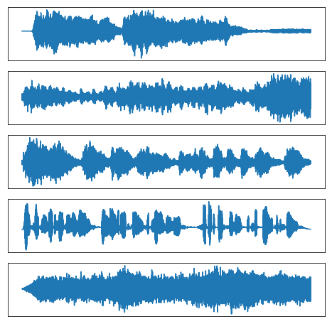

# Machine Learning 2

[](LICENSE)

## Description

Code for the labs of the [Machine Learning 2 course](http://coursecatalogue.uva.nl/xmlpages/page/2017-2018-en/search-course/course/34043) at the University of Amsterdam.

### Lab 1 - Independent Component Analysis (ICA)
- [Assignment and Solutions](src/lab1/lab01_KIANFAR_GALLEGO.ipynb)

Original Signals             |  Reconstructed Signals
:-------------------------:|:-------------------------:
  |  


### Lab 2 - Sum-Product and Max-Sum Algorithms
- [Assignment and Solutions](src/lab2/lab02_KIANFAR_GALLEGO.ipynb)

Original Signals             | 
:-------------------------:|
  | 


### Lab 3 - Expectation Maximization (EM) and Variational Autoencoders (VAE)
- [Assignment and Solutions](src/lab3/lab03_KIANFAR_GALLEGO.ipynb)

EM on MNIST             |  Learned Manifold of the VAE on MNIST
:-------------------------:|:-------------------------:
  |  

## Testing
Refer to each lab and run the iPython notebook as follows.
``` 
jupyter notebook $notebook_name$.ipynb
```

## Dependencies
iPython notebook
- Lab 1: SciPy, NumPy, matplotlib
- Lab 2: itertools, NumPy, matplotlib
- Lab 3: gzip, SciPy, torch, matplotlib

## Contributors

- [Dana Kianfar](https://github.com/danakianfar)
- [Jose Gallego](https://github.com/jgalle29)

## Copyright

Copyright © 2017 Dana Kianfar and Jose Gallego.

<p align="justify">
This project is distributed under the <a href="LICENSE">MIT license</a>. Please follow the <a href="http://student.uva.nl/en/az/content/plagiarism-and-fraud/plagiarism-and-fraud.html">UvA regulations governing Fraud and Plagiarism</a> in case you are a student.
</p>